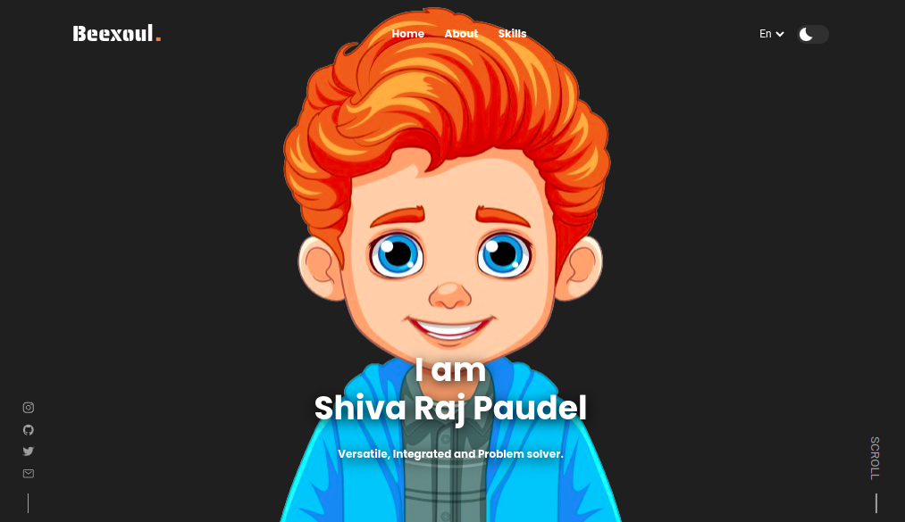

 # Personal Portfolio Website

## Screenshots

Dark Theme</img> 
White Theme</img>  

Welcome to my official personal portfolio website! This website showcases my skills, Tools, and provides information about me, Shiva Raj Paudel.

## Table of Contents

- [Introduction](#introduction)
- [Features](#features)
- [Getting Started](#getting-started)
- [Usage](#usage)
- [Technologies Used](#technologies-used)
- [Contact](#contact)
- [License](#license)

## Introduction
A personal portfolio website designed to present my skills as a Full-Stack Developer and showcase my Skills. The website is responsive, providing a seamless experience across different devices.

## Features

- **Responsive Design:** The website is designed to be accessible and user-friendly on various devices, ensuring a consistent experience.
- **About Me Section:** Learn more about me, Shiva Raj Paudel, my background, and my passion for Full-Stack Development.
- **Skills Section:** Explore the programming languages, tools, and technologies that I specialize in.
- **Contact Information:** Connect with me through various social media channels or via email.

## Getting Started

To explore the website, simply open the [Beexoul Portfolio](www.shivarajpaudel.com.np) link in your web browser.

## Usage

Feel free to navigate through different sections using the menu. Check out my skills, learn more about me in the "About" section, and explore the projects showcased. Don't forget to download my CV for more details.

## Technologies Used

- HTML5
- CSS3
- JavaScript
- Ionicons
- Fonts: Poppins, Roboto, Saira Stencil One (from Google Fonts)
- Responsive design principles

## Contact

Connect with me on social media:
- [Instagram](https://www.instagram.com/not_beexoul/)
- [GitHub](https://github.com/Beexoul)
- [Twitter](https://twitter.com/shivarajpaudel_)

Thank you for visiting my portfolio website! If you have any feedback or suggestions, feel free to reach out.
